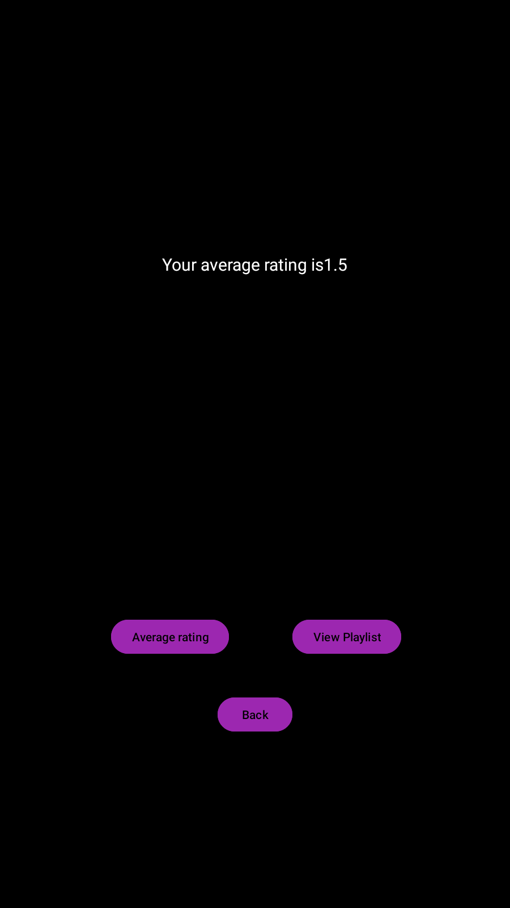
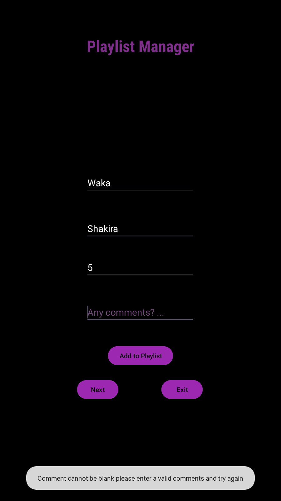
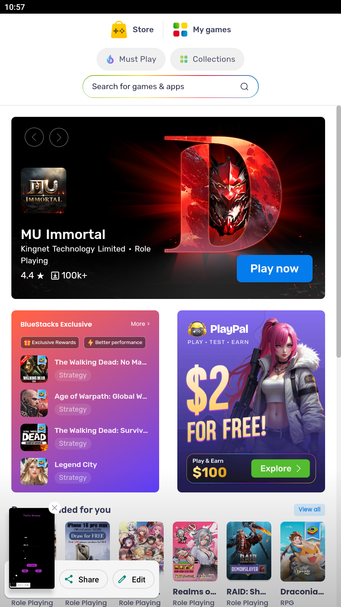

# Practicum

## About my app
This is my readme which i was rquired to create for this practicum.Below you will find my written report,screenshots of my app as well as the link to my github repository

## Report
The App that i've created is a playlist manager app ,it allows the user to store songs as well as rate these songs and add any comments they may have regarding the song.The app also has a sceond screen where the user can view the sings they've added to the list and calculate the average rating the gave the songs within the list.The Ui was designed in way which makes it easy to understand and use.Github actions were used to run automatic testing of the app.

## Screenshots
This is an image of my app when opened
Image: .png)
This is an image of my app when an invalid input is entered
Image: .png)
This is an image of my app when all inputs are valid
Image: .png)
This is an image of my app when the next button is clicked
Image: .png)
This is an image of my app when View Playlist button is clicked
Image: 
This is an Image of my app wehn average rating button is clicked
Image: 
This is an image of my app when back button is clicked
Image: 
This is an Image of my app when Exit button is clicked
Image: 
These are screenshots of my code for my first screen
Image:
Image:
This is a screenshot of my second screen of code
Image: 

## Github Link
https://github.com/Josh-Cloete0/PracticumOfficial.git